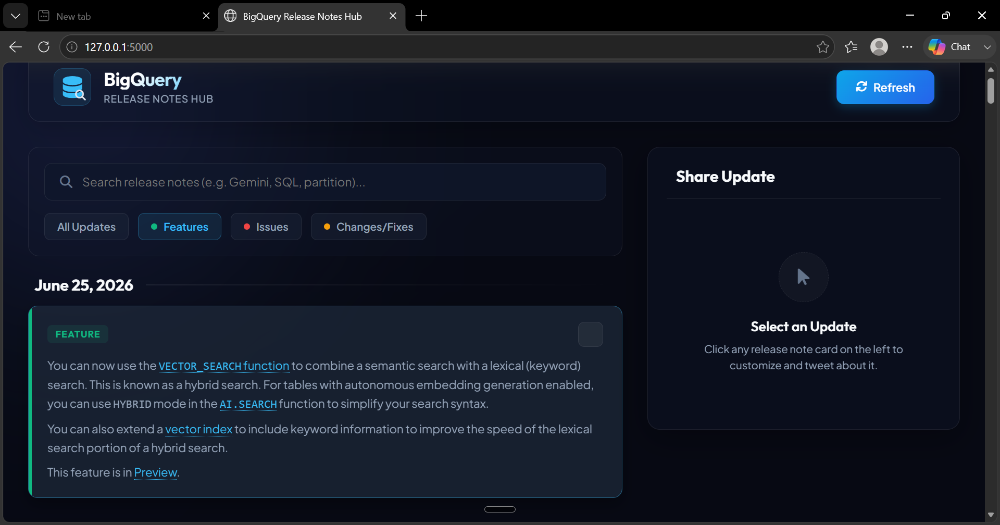
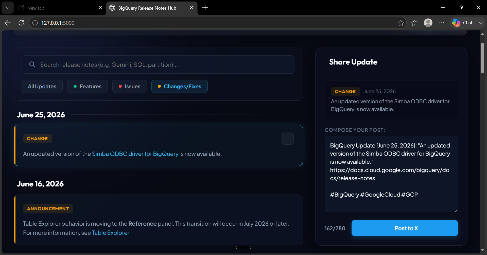

# 🚀 BigQuery Release Notes Hub

<p align="center">

**A modern Flask-powered web application for exploring, searching, filtering, and sharing Google Cloud BigQuery Release Notes.**

Designed for developers, cloud engineers, data analysts, and BigQuery users to stay up to date with the latest product announcements, features, bug fixes, and improvements.

</p>

---

## 📖 Project Overview

**BigQuery Release Notes Hub** is an interactive web application built using **Python Flask**, **HTML5**, **CSS3**, and **JavaScript**.

The application automatically fetches the official **Google Cloud BigQuery Release Notes**, parses them into individual updates, categorizes them, and presents them in a clean, searchable dashboard with a modern dark interface.

Users can instantly search release notes, filter updates by category, and generate ready-to-share posts for **X (Twitter)**.

---

# ✨ Features

* 🔄 Fetches the latest BigQuery Release Notes automatically
* 📑 Parses XML/RSS release feeds into individual updates
* 🔍 Instant keyword search
* 🟢 Filter by Features
* 🔴 Filter by Issues
* 🟡 Filter by Changes & Fixes
* 📢 Support for Announcements
* 🌙 Modern Dark Theme
* 🎨 Glassmorphism UI Design
* 📱 Fully Responsive Layout
* 📝 X (Twitter) Post Generator
* 🔢 Live Character Counter
* 🔄 One-click Refresh

---

# 📸 Screenshots

## 🏠 Home Dashboard

Browse the latest BigQuery updates in a clean and responsive dashboard.

```markdown

```

---

## 🔍 Feature Filter

View only newly released BigQuery features.

```markdown

```

---

## 📢 Changes & Fixes

Explore updates, announcements, and bug fixes.

```markdown

```

---

# ⚙️ Tech Stack

| Technology | Purpose            |
| ---------- | ------------------ |
| Python     | Backend            |
| Flask      | Web Framework      |
| HTML5      | Frontend Structure |
| CSS3       | Styling            |
| JavaScript | Client-side Logic  |
| Requests   | Fetch XML Feed     |

---

# 🏗 System Architecture

```text
Google Cloud BigQuery Release Notes
                │
                ▼
        Flask Backend
                │
                ▼
       RSS/XML Feed Parsing
                │
                ▼
    Categorization Engine
                │
                ▼
 Search & Filter Processing
                │
                ▼
 Responsive Dashboard UI
                │
                ▼
 X (Twitter) Post Generator
```

---

# 📂 Project Structure

```text
bigquery-release-notes-hub
│
├── app.py
├── requirements.txt
├── README.md
├── LICENSE
│
├── images
│   ├── home.png
│   ├── features.png
│   └── changes.png
│
├── static
│   ├── css
│   ├── js
│   └── assets
│
└── templates
    └── index.html
```

---

# 🚀 Installation

## Clone Repository

```bash
git clone https://github.com/Pranith-g/bigquery-release-notes-hub.git
```

Move into the project directory

```bash
cd bigquery-release-notes-hub
```

Install required packages

```bash
pip install -r requirements.txt
```

Run the application

```bash
python app.py
```

Open your browser

```text
http://127.0.0.1:5000
```

---

# 💻 Usage

1. Launch the application.
2. Click **Refresh** to fetch the latest release notes.
3. Search updates using keywords.
4. Filter by category.
5. Click a release note card.
6. Customize the generated X (Twitter) post.
7. Copy and share it.

---

# 🎯 Why This Project?

Reading official release notes can be time-consuming.

This project provides a faster and more user-friendly experience by:

* Organizing updates into categories
* Improving readability
* Providing instant search
* Supporting responsive layouts
* Creating social-media-ready summaries
* Making BigQuery updates easier to explore

---

# 🛣 Future Enhancements

* AI-powered release note summaries
* Google Gemini integration
* Email notifications
* Export as PDF
* Bookmark favorite updates
* Docker support
* CI/CD with GitHub Actions
* Multi-product Google Cloud support
* Theme customization
* User authentication

---

# 🤝 Contributing

Contributions are welcome!

1. Fork the repository.
2. Create a new feature branch.
3. Commit your changes.
4. Push to your fork.
5. Open a Pull Request.

---

# 📜 License

This project is licensed under the **MIT License**.

See the **LICENSE** file for more details.

---

# 👨‍💻 Author

**Pranith G**

Diploma in Computer Science Engineering

Python Developer • Cloud Computing Learner • Data Analytics Enthusiast

GitHub: https://github.com/Pranith-g

---

# ⭐ Show Your Support

If you found this project helpful, please consider giving it a **⭐ Star** on GitHub.

It motivates future improvements and helps others discover the project.

---

## 🙏 Acknowledgements

* Google Cloud BigQuery
* Flask Community
* Python Software Foundation
* Open Source Community
